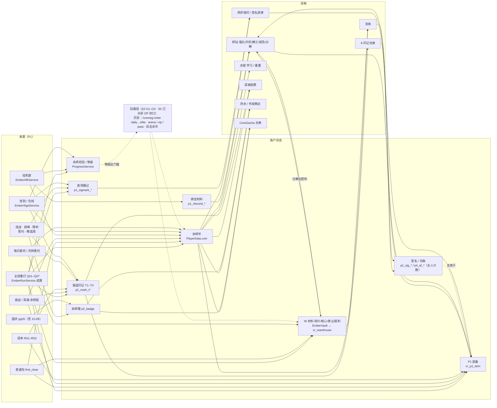

# ARCH · Ember 系统地图（2026-10-05）— 清单、数据流、重叠、缺口、分阶段计划

> **性质：** 离线架构审查（review），**不是决策**：不占 D 号、不改源码 / 配置 / `tools/p1sim`、不构建、不部署、不开机器人。
> **基线：** `main` = `origin/main` `850a7d3`；线上 CoreRpg **1.65.34**、`balance_version` **57**（`docs/status/RELEASE-ember-1.65.34.md`）。
> **背景：** 服主 2026-10-05 12:19 暂停小内容包（词缀 / 房间事件 / 首领招 / 周规则），重点转向系统架构（`/workspace/COORD-POLICY-testing.txt` POLICY 12:19）。
> **方法：** 逐个读 `CoreRpg/src/main/java/town/sunshine/corerpg/**`（61 个顶层 / `storage` 类 + 55 个 `p1/`（含 `map/`）类，连测试约 6 万行）、`plugins/CoreRpg/*.yml`、`plugins/DungeonPlus/dungeon/*`、`plugins/TrMenu/menus/*`、`CoreGacha/` 与其它自研插件源码、`docs/design/**`、`docs/reviews/review-gpt-comprehensive-2026-10-04.md`、`docs/status/RELEASE-*`。
> **证据等级：** 【码】源码确认 ·【配】配置确认 ·【文】只见于文档 ·【待测】代码路径推断、尚未实服验证。下文路径省略前缀时：`J/` = `CoreRpg/src/main/java/town/sunshine/corerpg/`，`P/` = `plugins/CoreRpg/`。
> **硬约束（本文所有建议都遵守）：** 主线 Q01–Q07 是核心、每图有值得刷的装备并解锁新玩法；签名传奇只改行为、不加伤害乘区；挂机 = 装备决定效率的自动战斗、按击杀、日封顶低于副本、挂机时间算在线；不加新的永久战力槽 / 乘区（只做 sidegrade）；旧宝石系统保持关闭；外观暂缓；平衡用离线模拟「在范围内」即可、终调等真人；目前没有真实玩家；设计先对照成熟游戏。

## 0. 一页结论

1. **P1 已经是一套完整的第二个游戏，但它寄生在旧插件骨架上。** `CoreRpgPlugin.onEnable`（`J/CoreRpgPlugin.java:148–277`）仍无条件实例化 40 多个旧服务；P1 的烬斩、药水、进本路由、经验、材料仓数据分别住在旧类 `SkillService` / `LifeService` / `QuestService`+`TicketEntryService` / `ProgressService` / `WarehouseService` 里【码】。
2. **旧奖励路径曾是最大结构风险，S0 已对普通玩家封口（D198–D202 / 1.65.35–1.65.38）**【码 / 配】：`LegacyGate` + `ember-v1.yml legacy_gate` 挡住 `/corerpg enter <旧>`、`/dp start` 旧 gate、`arena/vip/pass/calamity/scrap/…` 路由，以及旧经验 / 击杀币 / 灾厄结算纵深防御。OP / `corerpg.admin` / 控制台仍放行（DP/MM 发奖脚本要走控制台）。历史口子见 AUDIT；残余提案仅 S0-9（世界级传送兜底，D251=HOLD）。S0-10 旧仓库只读已落地（D252 / 1.65.71）。这些旧来源仍不在 p1sim / p2econ 里——因为玩家侧已为 0。
3. **玩家状态是一个字符串键大杂烩**：约 70 种计数器前缀挤在 `PlayerData.counters`（`cr_players.data` 一列 LONGTEXT）里；连「这件装备的词条 / 签名」都记在**主人**的计数器上（`p4_af_<uid>`、`p1_sig_<uid>`），不在 `cr_p1_item`，分解后也不清理【码】。
4. **上帝类**：`EmberRunService` 3,774 行（入场、深渊、团本倒地、连战、结算、图录、投递、重启恢复、誓约、招募、PAPI 全在一起）、`EmberRunDirector` 2,471 行（每个内容包都是手写分支）、`CoreRpgPlugin` 1,856 行、`EmberGrowthService` 1,629 行【码】。每个内容包 = Java + yml + p1sim 模型 + 专用冒烟脚本，成本不会因为「暂停」而下降。
5. **「每张图有自己的装备」目前只靠签名传奇 + 首领徽记实现**：基础件只有 3 个阶级 × 族 / 部位偏向（`loot_bias`），物品身份里没有来源地图（`source` 只有 `quest` / `drop`，`J/p1/EmberRunService.java:1839`）【码】。装备结构（6 槽 D169 / 6 槽第 0 阶段 / 8 槽 D168）三份文档互相取代，结构代码仍 HOLD【文】。
6. **资产路径的事务化（D162 / D172）做得扎实**，残留窗口已在审查附录写明；剩下的主要缝隙是跨插件（CoreGacha 反射改 CoreRpg 的 `PlayerData`）；旧 `/corerpg warehouse` 写路径已对非 OP 收口（S0-10 / D252，只读 list/info）【码】。
7. **建议顺序：** S0 封口旧路径 → S1 状态模型与计数器注册表 → S2 奖励 / 经济管线统一（一张来源-消耗-上限表，p2econ 同读）→ S3 拆分遭遇引擎为数据驱动原语 → S4 再做装备结构与每图身份。第一个可派的活是**旧路径可达性审计表**（§6 N1）。

---

## 1. 系统清单

作用域说明：「P1 开关」= `EmberMode.active()`（`P/ember-v1.yml` `enabled: true`）；「P1 世界」= `EmberMode.isP1(...)`，只有 `scope.worlds: [ember_afk]` 和前缀 `dungeon_EmberQ0`（`P/ember-v1.yml:8–14`）。枢纽 `ember_hub` **不是** P1 世界（D61），所以锻造、仓库等在枢纽里只看 P1 开关。`EmberMode` 类注释仍写「Default OFF」，但现行配置是开【码 / 配】。

### 1.1 装备与成长

| 系统 | 目的 | 主要类 / 配置 | 持久化 | 开关 | 状态 |
|---|---|---|---|---|---|
| 装备身份与签名校验 | 每件 P1 刃 / 护符的可信身份（uid、族、部位、阶级、成色、精工、强化、保底、绑定、来源、rev） | `J/p1/EmberItemData`、`EmberItems`（NBT `ember_v1` + HMAC，密钥 `P/ember-v1-item.key`）、`NmsNbt`；NI 模板 `plugins/NeigeItems/Items/ember-v1-gear.yml` | `cr_p1_item`（权威）、`cr_p1_txn` 流水（`EmberItemStore`）；NBT 是副本、进服 resync | P1 开关 | 上线 |
| 穿戴（2 槽） | 主手刃 + 明确选定的护符 + `active_set` | `EmberLoadout`、`EmberLoadoutService`、`EmberPlayerState` | `cr_p1_loadout` | P1 开关 | 上线；6 / 8 槽未实现（HOLD） |
| 掉落 / 成色 / 精工 / 目标族 | 每局 1 件 + 宝箱 / 精英额外；成色、精工权重；目标族偏向；8 印记兑换 | `J/p1/EmberRunRules`（`BASE_COIN 300 / BASE_SHARD 24 / BASE_BONE 6 / BASE_CORE 2 / BASE_XP 120 / BASE_MARK 1 / TREASURE_COIN 100 / ELITE_SHARD 10 / ELITE_CORE 1 / MARKS_PER_EXCHANGE 8` 都是 Java 常量）；`P/ember-v1-runs.yml` `loot_bias`、`raid_item`、`maps.*.loot`、`challenge.quality`、`abyss.tiers[].quality`；`P/ember-v1.yml` `tables` | 物品行；`p1_target`、`p1_mark_t<n>` 计数 | P1 开关 | 上线 |
| 投入（强化 / 升阶 / 精工 / 成色 / 分解 / 互换） | 统一的工坊操作，预览即结果 | `EmberForgeService`（`cmd`：enhance / upgrade / refine / quality / dismantle / swap / sync）、`EmberUpgradeRules`、`EmberPay`+`EmberPayRules`（hold → pay → commit）、`EmberDelivery` | `cr_p1_txn`、`cr_p1_delivery`、PlayerData | P1 开关，且**不在** P1 世界 / 副本内（`EmberForgeService.gate`） | 上线；D167 随机锻造 / 烙纹 / 每周转化**只有设计**，代码里无对应操作 |
| 装备库 / 分解撤销 | 无限存放 P1 装备、软撤销 | `EmberGearLib`、`EmberStorageRules` | `cr_p1_item state=stored`、`cr_p1_gearlib`；`P/ember-v1.yml storage.gearlib`（`undo_minutes: 10`） | P1 开关 + MySQL | 上线 |
| 三套两件套 + 觉醒 | 焚烬 / 烬爆 / 炽愈被动与 I–III 觉醒 | `EmberSetEngine`、`EmberSetRules`（类注释：参数「fixed by the book; not exposed in config」）、`EmberSetService`、`EmberBurnBook` | 冷却跨换装保留（类注释） | P1 世界 | 上线 |
| 烬斩（唯一主动） | F 键共享主动 | **旧类** `J/SkillService.java:266–270`（`castEmberSlashP1`）与 `:344` `onSwapHotkeyP1`；倍率在 `EmberTables` | — | P1 世界 | 上线；三套共用一个主动（每套 / 每刃型主动 = 6 槽 Stage 3 设计） |
| 天赋专精 / 余烬勋记 / 词条洗练 | 横向成长（sidegrade）、账号一次性成就、每件 1 词条 | `EmberGrowth`、`EmberGrowthService`、`EmberAffix`；`P/ember-v1-growth.yml`（`talents` 3 排、`honors.caps`、`reroll`） | 计数 `p4_spec_*`、`p4_honor_*`、`p4_af_<uid>`、`p4_afp_<uid>` | P1 开关 | 上线 |
| 签名传奇 + 首领徽记 + 烙印 + 双签名 + 调律 | 每图首领的「改打法」效果；徽记是本图保底 | `EmberSignature`（常量 `STAMP_RATE 0.12`、`CLEAR_MARKS 1`、`FC_MARKS 3`、`IMPRINT_MARKS 5`、`IMPRINT_COIN_PER_TIER 300`、`ALT_MARKS 10`；`tools/p1sim/mainline.py SIGS` 手抄镜像）；钩子在 `EmberGrowthService`；菜单 `ember_p1_sig*.yml` | 计数 `p1_sig_<uid>`、`p1_sigmark_<map>`、`p1_sigfc_<map>`、`p1_sigalt_*`、`p1_sigoff_*` | P1 开关 | 上线（D174 第 1–3 阶段 + D183 / D184；Q01–Q06 各 2 件、Q07 3 件） |
| 图录 · 装备 | 展示 + 一次性资源 | `EmberCodex`、`ember_p1_codex*.yml` | `p1_codex_*`、`p1_codex_stage_*` | P1 开关 | 上线 |

### 1.2 战斗

| 系统 | 目的 | 主要类 / 配置 | 开关 | 状态 |
|---|---|---|---|---|
| 统一 B / H / D 公式 | `B = A×(1+e+q+f)+0.2×(L−10)` 等（类注释） | `EmberFormula`、`EmberTables`（`P/ember-v1.yml tables / crit / defense / sustain_hp_mult`） | P1 世界 | 上线 |
| 唯一伤害 / 治疗管线 | 所有 P1 伤害、治疗只走一条路 | `EmberCombatListener`、`EmberHeal`（HealLedger）、`KnockbackGuard`、`ChargeEstimator`、`EmberDamageTrace`（只读探针） | P1 世界 | 上线 |
| 第二属性引擎冲突检测 | 拒绝与另一个属性插件共存（A23） | `EmberMode.checkConflicts`；AttributePlus 已在 `plugins/_parked/` | — | 上线 |
| 旧战斗源关闭 | 旧套装 / 旧刃被动 / 灰印 / 契约主动 / 组队缩放 | `SetService:113`、`GearPassiveService:145/158`、`SkillService:267/697`、`CalamityService:504` 的 `isP1` 短路 | P1 世界 | 上线 |
| 药水 / 补给 / 起步 / 死亡退药 | 标准药、商店价 10、起步 5 瓶 | **旧类** `LifeService:160 consumeP1` + `EmberSupplyService`；`P/ember-v1.yml heal_potion / shop / starter / death_refund` | P1 开关 | 上线 |

### 1.3 主线、团本与模式（都在 `EmberRunService` / `EmberRunDirector` 里）

| 系统 | 目的 | 主要类 / 配置 | 持久化 | 状态 |
|---|---|---|---|---|
| 主线 Q01–Q07 | 入场 reserve → create → commit、每房 A/B、首领、唯一结算 | `EmberRunService`、`EmberEntryService`、`EmberSessionService`、`EmberSettleService`、`EmberRunSession`、`EmberRunDirector`、`EmberRunMaps`、`EmberRunBridges`（MM / DP 反射）；`P/ember-v1-runs.yml maps.q01..q07`；DP `plugins/DungeonPlus/dungeon/EmberQ01..07`；入口 `TicketEntryService.Kind.Q01..Q07` → `EmberRunService.tryEnter` | `EmberRunStore`：**权威是 YAML**（`P/p1-runs/runs/*.yml`、`p1-runs/ledger/<player>.yml`），MySQL `cr_p1_run` / `cr_p1_reward` 只是镜像 | 上线 |
| 解锁链 + 首通包 | `requires / unlocks`；Q01 自选护符、Q02 自选件、Q03–Q07 材料 + 币 | 同上 `maps.*.first_clear` | `p1_first_clear_<map>@<content_version>`（`EmberRunService:200/1521`，「once per character + content version」）、`p1_unlock_*` | 上线 |
| 每图新解锁 | Q01 签名 + 徽记 + 图鉴；Q02 烬炉烙印；Q03 双签名；Q04 首领残响；Q05 连战·前哨；Q06 自选誓约；Q07 签名调律 | `docs/design/DESIGN-ember-mainline-unlocks-2026-10-04.md §0`；代码分散在 `EmberRunService`（誓约 §2711、连战 §1259）与 `EmberGrowthService`（烙印 / 调律） | 各自计数 | 上线 |
| 重打花样（已暂停扩包） | 词缀精英 12 种、房间事件 9 种、奖励精英每图 2 招 | `EmberRunDirector` §531 / §1158 / §1256 / §1468；`P/ember-v1-runs.yml variety / elite_twists` | `p4_vb_*` | 上线；新包暂停（POLICY 12:19） |
| 首领招与破绽 | 预警招、半血招、撞墙 / 落空 / 破招 | `EmberRunDirector` §1788；`maps.*.boss.skills`（`wall_stun / whiff_stun / break_hp`） | — | 上线；新招暂停 |
| 挑战版 | Q07 后同图高难 | `P/ember-v1-runs.yml challenge`（`requires: q07, tier: 3`） | `p4_chal_*` | 上线 |
| 深渊 · 余烬层（P1） | 10 层硬上限；层费币或剩余 T3 印记（`fee_mark_coin: 200`） | `EmberRunService` §237「P2-2 abyss」；`abyss:` | `p2_abyss_best` 等 | 上线 |
| 团本 R01–R03 | 3 人团；最后阶段复活；合计周上限 | `P/ember-v1-runs.yml raids`（`EmberQ0R1..3`）、`raid_revive`；`EmberRunService` §901 / 招募板 §3215 | `p2_raid_*` | 上线 |
| 余烬连战 / 连战·前哨 / 首领残响 | 周首通领奖、失败无限重试（D160） | `rush:`（`EmberQ0B1` 链 q05→q07；`EmberQ0B2` 前哨与 `echo_q01..q04`） | `p4_rush`、`p4_rush_claim`（周） | 上线 |
| 国庆「烟火庙会」 | 限时活动本 + 活动币 + 纪念兑换 | `EmberFestival`、`map/FestMapTheme`；`P/ember-v1-festival.yml`（`end: 2026-10-08T00:00:00+08:00`） | `p3_fest_*` | 上线至 10-08，之后休眠 |

### 1.4 周期与日常

| 系统 | 目的 | 主要类 / 配置 | 持久化 | 状态 |
|---|---|---|---|---|
| 精选图轮换 + 周规则 | 每周一张精选图、挑战（及条件下普通）加印记；14 条只改打法的规则 | `P/ember-v1-runs.yml rotation`（`bonus_marks 1`、`weekly_cap 3`、`normal_bonus_marks 1`）；`EmberRunMaps.modifierIndex` | `p2_rotation` | 上线；新规则暂停 |
| 周目标 + 赛季 + 排行 | 只发余烬徽 / 外观 | `EmberSeason`、`EmberLeaderboard`（`P/p1-runs/leaderboard.yml`）；`weekly_goals`（`reward 15`、`bonus 20`）、`season`（锚 2026-09-28、4 周） | `p3_goal_*`、`p3_goalpay_*`、`p3_badge`、`p3_season_*` | 上线 |
| 每日委托 / 花样委托 | 每日 1 / 3 局给币与碎片；花样计数 | `P/ember-v1.yml bounty.daily / variety` | `p2_bounty`、`p4_vb_*` | 上线 |
| 签到 + 在线时长 | 月累计签到、15/30/60/120 分钟档；挂机庭算在线 | `EmberSignService`；`P/ember-v1.yml signin / online`（`exclude_worlds: []`、`afk_combat_counts: true`）；`ember_p1_sign.yml` | `p1_sign_*`（含回拨防护 `p1_sign_last`）、`p1_on_*` | 上线（D180 rev 2） |
| 挂机庭（自动战斗） | 4 层（需首通 q01 / q03 / q05 / q07）；按击杀确定性累加；日 2400 只、离线 25% ≤ 1200 只；奖励只发币 / 经验 / **账号绑定**材料 | `J/p1/EmberAfkService`；`P/ember-v1.yml afk`（`legacy_payouts: false`）；MM `plugins/MythicMobs/Mobs/EmberAfk.yml`；旧 `AfkTierService` 在 P1 下委托给它（`AfkTierService:161–313`） | `p1_afk_*`、`bmat:` → `p1_vbound_<id>` | 上线（D177 rev 2） |
| 失败退体力 / 每日首次倒下退药 | 挑战 / 深渊首败退一半体力 | `fail_refund: 0.5`；`death_refund` | `failrefund@<day>` | 上线 |

### 1.5 经济：货币与存放位置

| 货币 | 存哪 | 主要来源（P1） | 主要消耗（P1） | 能否转移 |
|---|---|---|---|---|
| 余烬币 | `PlayerData.coin`（`cr_players.data`）——**与旧系统同一个字段** | 每局 300、首通 600–2100、宝箱怪 100、委托 30 / 60、签到 / 在线、挂机 60–120 / 天（满额） | 工坊、洗练 `[0,300,600,1000]`、天赋 800 / 2000 / 4000 + 重置 2000、烙印 300×阶、深渊层费 60–480、药 10、外观商店、扭蛋 1200 / 张 | 不能（旧寄售 P1 下关闭，`legacy_auction: false`） |
| 余烬经验 / 等级 | 旧 `ProgressService`（`P/progress.yml ember_xp.curve`） | 每局 120、签到 / 在线 / 挂机 | 公式里的 L；**同时也是旧本等级门槛**（`P/progress.yml level_gates`: daily 10 … elite 40） | — |
| 碎片 / 核心碎片 / 骨尘 / 胚料 | NI 物品 `mat_ember_shard / mat_ember_core_fragment / mat_ember_bone_dust / mat_ember_v1_blank`；P1 材料仓 `EmberVault`（复用旧 `WarehouseService` 数据，`cr_warehouse`）+ `cr_vault_log` | 每局 24 / 2 / 6、精英 10 + 1、词缀 2、事件 1、首通、分解出胚料 | 工坊、洗练 | 不能：D177 起禁丢出 / 入世界容器 / 展示框 / 盔甲架（守卫写在 `EmberAfkService:667–723`，见 §3 O9）|
| 绑定材料 | `bmat:` 账本 → `p1_vbound_<id>` | 挂机庭 | 同上 | 不能取出 |
| 锻造印记 T1–T3 | `p1_mark_t<n>` | 每局 1、精选周、签到第 14 / 28 次、连战 1 T3、前哨 1 T2 | 8 枚兑换、深渊层费（200 币 / 枚） | 不能 |
| 首领徽记（每图） | `p1_sigmark_<map>` | 重打 1、首通 3（每图一次）、残响、前哨、誓约（每条 +1）、签到第 7 / 21 次 | 烙印 5、调律 10 | 不能 |
| 余烬徽 | `p3_badge` | 周目标、连战 20、国庆兑换（≤ 40） | 外观商店（1 徽 = 50 币标价）、扭蛋 20 / 张 | 不能 |
| 体力 | 旧 `StaminaService` + `P/cash.yml stamina`（`base_max 90`） | 每日回满；月卡 +30、体力药（旧） | 每局 30 | — |
| 扭蛋券 / 光屑 / 火花 | CoreGacha `gacha_wallet` 等 | 币 / 徽兑换（`plugins/CoreGacha/config.yml` `exchange: coin 1200, badge 20, daily_cap 5`）、实物券 | 抽外观 | — |
| 国庆币 | NI `ember_fest_coin_gq26`（仓库白名单） | 活动本 | 活动兑换 | 活动后仅剩兑换 |

### 1.6 存储、数据保护与运维

| 组件 | 职责 | 位置 |
|---|---|---|
| 玩家行 | 币、计数器、仓库槽等一个 blob | `J/PlayerData`、`PlayerDataStore`、`J/storage/MysqlStorage`（`cr_players.data LONGTEXT`；`savePlayerAndWarehouse` 与 `cr_warehouse` 同事务，D162） |
| P1 物品与流水 | 装备权威、流水、投递、运行镜像 | `J/p1/EmberItemStore`：`cr_p1_item / cr_p1_loadout / cr_p1_txn / cr_p1_run / cr_p1_reward / cr_p1_gearlib / cr_p1_delivery` |
| 付款与补偿 | 先 hold、再扣费存档（`p1paid_`）、再提交、进服对账 | `EmberPay`、`EmberPayRules`、`EmberDelivery`（`p1dlv_`） |
| 资产冻结 | 恢复中 / 写库连续失败时挡住资产变更 | `EmberAssetGuard`；`DbGuard`（MySQL 配了但启动连不上 → 拒绝进服） |
| 故障注入 / 审计 | 测试专用钩子（`CORERPG_TEST_FAULTS=1`）、在线物品对账 | `EmberFaults`、`EmberAudit` |
| 背包快照 | 每 10 分钟原版背包 / 末影箱快照；按账本净扣恢复（D157 / D158） | `J/InvSnapService`、`InvSnapRules`（`cr_inv_snapshot`、`P/invsnap-pending.yml`） |
| 备份 | 每小时 DB + 玩家文件，48 小时 + 30 天，日备份另拷一份 | `scripts/ember-backup.sh`、`ember-backup-loop.sh`（`/workspace/backup/db-auto`、`/home/box/ember-db-backups`）；`db-dump.sh / db-restore.sh` |
| 发布凭证 | 源码 SHA、jar sha256、bv、回滚包 | `docs/status/RELEASE-ember-1.65.*.md` |

权威存储的分工已在 `docs/reviews/review-gpt-comprehensive-2026-10-04.md`「A03 权威存储」表里写清（装备 → `cr_p1_item`；材料 / 币 / 计数 → `cr_players`+`cr_warehouse`；实物 → `.dat`；应发 → `cr_p1_delivery`；扭蛋 → CoreGacha 表），残留 4 个窗口也列在那里【文】。

### 1.7 CoreGacha 与其它自研插件

- **CoreGacha**（`CoreGacha/src/main/java/town/sunshine/coregacha/`，21 个文件 2,908 行，含 `EngineTest`）：只出外观（`plugins/CoreGacha/gacha.yml` 头注释）；软保底 60 起、硬保底 80、火花 200；表 `gacha_wallet / gacha_pity / gacha_banner_state / gacha_owned / gacha_wear / gacha_pull / gacha_ledger / gacha_daily`（`Db.java`）；和 CoreRpg 共用库 `ember`。**通过反射**改 CoreRpg 的 `PlayerData`（币、余烬徽 `p3_badge`、外观购买计数 `p2_cosbuy_`）——`CoreRpgBridge.java` 类注释：「without touching CoreRpg source … by reflection」【码】。
- **其它**（各 1–4 个类）：CoreCombat（NI 不死图腾 + 盾牌格挡）、CoreAnvil（铁砧费用；修复材料含 `mat_ember_shard / mat_ember_core_fragment`）、CoreCraft（用碎片 / 骨尘 / 核心合 `crystal_ember_enchant`）、CoreEnchant、CoreFish、CoreBrew、CoreSmelt、CoreWorldRules（禁村民交易、原版掉落 / 经验球 / 自然刷怪）。**都不引用** `EmberMode` / `dungeon_EmberQ0` / `ember_afk`（grep）【码】。

### 1.8 菜单、文本、占位符

- TrMenu：`plugins/TrMenu/menus/` 66 个 yml，其中 `ember_p1_*` 21 个；P1 主菜单 `ember_hub.yml` 还链接旧菜单 `ember_flex_skill / ember_life / ember_mail / ember_friends / ember_bestiary`【配】。
- PAPI：`J/CoreRpgExpansion`、`EmberLadderExpansion`、`EmberRunService` §3619 `%corerpg_p1_*%`、`EmberGrowthService` `%corerpg_p1_sig_*%`、CoreGacha `GachaExpansion`。
- 文本：玩家可见中文大量写在 Java 字符串里（如 `EmberForgeService.sources` 157–161 写死「碎片：每局通关 24」等来源说明），其余在 yml / TrMenu。

### 1.9 仍被实例化的旧系统（P1 下状态）

`CoreRpgPlugin.onEnable:164–215` 无条件创建：Enhance / Calamity / Covenant / Talent / Cash / TicketGrant / TicketEntry / Stamina / Elite / Scrap / Mail / Friend / Ladder / Pet / Guild / Arena / Auction / Warehouse / AbyssSettle / Skill / FlexSkill / Set / GearPassive / Raid / Progress / Quest / Life / Forge / Part / AfkTier / HubPlaza / HubNpc / AbyssShaft / WeeklyCorridor / EliteCorridor / 7 个 Daily*Service / RaidHall / CalamityBasin / Loot / Stat。顶层 60 个类里只有 10 个引用 `EmberMode`，其中 9 个有 `active()` / `isP1` 判断（`CoreRpgPlugin` 10 处、`StatService` 7、`SkillService` 4、`QuestService` 4、`GearPassiveService` 2、`SetService` / `LifeService` / `InvSnapService` / `CalamityService` 各 1）；其余 50 个**不引用** `EmberMode`（`AfkTierService` 经 `EmberAfkService`、`TicketEntryService` 经 `Kind.p1()` 间接区分，其它完全不区分）【码】。命令层只有 `auction`（`CoreRpgPlugin:1062`）和 `sign / activity / bounty`（`:1207 / :1237 / :1287`）在 P1 下关掉了旧发奖。

---

## 2. 依赖与数据流

### 2.1 来源 → 账户状态 → 消耗

### 2.2 说明

- **主循环（与服主方向一致）**：主线结算是唯一同时产出装备、币、材料、印记、徽记的来源；挂机庭只产币 / 经验 / 绑定材料，满额每天 60–120 币（`P/ember-v1.yml afk.tiers`），低于一局主线的 300 币（`EmberRunRules.BASE_COIN`）——「挂机低于副本」在数值上成立【配 / 码】。挂机效率来自真实 P1 普攻公式（`afk` 注释：「自动普攻（真实 P1 满蓄力一击…）」），所以装备 → 挂机速度 → 材料 → 回去养装备的闭环成立，但挂机**不产任何装备或徽记**。
- **一个币、两个世界**：余烬币只有一个字段，旧系统（竞技、勋阶、月卡、战令、邮件附件、旧击杀）和 P1 都往里写；`CoreGacha` 也通过反射直接读写它（`CoreRpgBridge`）。
- **经验串起新旧（入口已闸）**：P1 仍用旧 `ProgressService.grantFlatEmberXp` 发经验，等级仍是旧本门槛键；但 S0-1/S0-2 已让普通玩家进不了旧本，S0-4 也挡住旧 source 的经验发放——「升级 ≈ 解锁旧本」在玩家侧不再成立（§3 O1 CLOSED）。
- **徽记 / 印记的来源很多**：同一种首领徽记有 6 条来源（重打、首通、残响、前哨、誓约、签到），每条有自己的计数器与周 / 月上限，规则分散在 `EmberRunService`、`EmberSignService`、`EmberGrowthService`（grep `EmberSignature.C_MARK`）【码】。

### 2.3 谁读写玩家状态

| 存储 | 写入者（主要） | 读取者 |
|---|---|---|
| `PlayerData`（`cr_players.data` blob：币、≈ 70 种计数器前缀、旧字段） | 几乎所有 P1 服务 + 14 个旧服务（`addCoin` 出现在 Arena / Auction / Cash / Enhance / Forge / Guild / Ladder / Life / Mail / Warehouse / CoreRpgPlugin 等）+ CoreGacha 反射 | 全部；p1sim 不读（只读配置） |
| `cr_warehouse`（材料仓） | `EmberVault`（主路径）、旧 `WarehouseService`（P1 非 OP 只读，D252；OP 仍可写）、自动入仓 | `EmberForgeService`、`EmberGrowthService`（洗练）、InvSnap 对账 |
| `cr_p1_item / cr_p1_txn / cr_p1_delivery / cr_p1_gearlib` | `EmberItemStore`（单线程有序队列）经 `EmberForgeService`、`EmberGearLib`、`EmberRunService` 结算、`EmberDelivery` | `EmberLoadoutService`（穿戴校验）、`EmberAudit` |
| `p1-runs/ledger/*.yml`（权威）+ `cr_p1_run / cr_p1_reward`（镜像） | `EmberRunStore` | `EmberRunService`（幂等判断）、`EmberSignService`（`rs.grantRow` 也用同一账本） |
| 原版 `.dat`（背包 / 末影箱实物） | 引擎；关键点同 tick `saveData`（D161） | InvSnap、`EmberDelivery`（按 uid 判断已发） |
| `gacha_*` | CoreGacha（自身单事务） | CoreGacha、InvSnap（D158 按 `gacha_ledger` 净扣） |
| `p1-runs/leaderboard.yml` | `EmberLeaderboard` | 排行显示 |

---

## 3. 重叠与冲突

**O1 · 旧副本入口曾可达且发 P1 材料 → CLOSED（S0-1 / S0-2，D198，1.65.35）**【码 / 配】
- **现状：** P1 开着时，普通玩家 `/corerpg enter <旧 kind>` 被 `TicketEntryService` 拒绝；`/dp start` 旧本被 `%corerpg_gate_*%` / `guildboss_pass` 返回 `"no"`。OP / 控制台仍可测本。
- **历史（审计快照）：** `TicketEntryService.tryEnter` 曾只对 `kind.p1()`（q0x）转给 `EmberRunService`；`DAILY…DAILY_RAIL / WEEKLY / ABYSS / RAID / ELITE` 走旧流程且**不查** `EmberMode`。
- **历史发奖形态（配置仍在，入口已闸）：** 旧本 `option.yml` 仍写 `ni give` 核心碎片 / 碎片等（正是 vault 白名单 id）；11 个旧 DP 本含 `mat_ember_shard`。等级门槛仍在 `progress.yml level_gates`，但非 OP 进不去。主菜单本就不链旧本；命令侧由 S0-2 拒绝。
- **历史战斗侧：** 旧本世界不在 P1 前缀（仅 `dungeon_EmberQ0`）；若有人（OP）硬开，击杀曾走 O3——现由 S0-4 纵深挡住。

**O2 · 旧的每日领币命令曾开放 → CLOSED（S0-3，D199，1.65.36；S0-5 场次上限 D201）**【码 / 配】
- **现状：** P1 开着时，`LegacyGate.refuseRoute` 拒绝普通玩家的 `arena` / `vip claim` / `pass free|claim` / `monthly` / `shop` 等（白名单见 `P/ember-v1.yml legacy_gate.allow`）。竞技场另有 `daily_coin_matches` 上限（即使日后重开也不无顶）。
- **历史：** `/corerpg arena claim` 80 币/天、`vip claim` 勋阶 0 也 20 币、月卡登录币、战令 `pass free/claim` 曾对所有人开放；D180 只关了 `sign/activity/bounty`。无权限插件、`plugin.yml` 多为 `default: true`——故必须靠路由闸，不能靠权限。

**O3 · 旧击杀币曾在 P1 世界外照发 → CLOSED（S0-4，D200，1.65.37）**【码 / 配】
- **现状：** P1 开着时 `legacyKillPayoutBlocked(world)` / `legacyXpBlocked(source)` 挡住非白名单世界的旧击杀币 / 旧经验；公共灾厄结算亦被拒。白名单世界见 `legacy_gate.kill_payout_worlds`（默认空 = 全关）。
- **历史：** `onDeath` 在 P1 本与挂机庭之外，对「余烬 / Ember / Crypt」名或僵尸 / 骷髅发 `kill_reward: 1`，且 `afk_caps` 外世界不封顶。

**O4 · 同一职能的新旧两套并存**【码】

| 职能 | P1 | 旧（仍实例化） |
|---|---|---|
| 深渊 | `EmberRunService` §237 + `abyss:` | `AbyssSettleService` / `AbyssShaftService` / DP `EmberAbyss`；`/corerpg abyss` 仍路由到旧 `abyssSettleService.cmdRoot`（`CoreRpgPlugin` 约 `:1004`） |
| 团本 | `raids: r01..r03` | `RaidService` / `RaidHallService` / DP `EmberRaid`，`/corerpg raid` |
| 套装 / 被动 | `EmberSetService` | `SetService` / `GearPassiveService`（P1 世界短路） |
| 天赋 / 誓约 | `EmberGrowth` 天赋专精；Q06「自选誓约」 | `TalentService` / `CovenantService`（「誓约」与「自选誓约」同名不同物；还有 `GuildService`「盟约」） |
| 锻造 / 分解 / 宝石 | `EmberForgeService` | `EnhanceService`（`P/enhance.yml enabled: true` + `socket:` 表）、`ForgeService`、`ScrapService`、`PartService` |
| 仓库 | `EmberVault`（复用旧数据） | `WarehouseService`（`/corerpg warehouse`；P1 非 OP 只读 D252） |
| 挂机 | `EmberAfkService` | `AfkTierService`（P1 下委托，OK）+ `P/config.yml afk_caps` 旧上限 |
| 外观 | `EmberCosmetics` 商店 | CoreGacha（`kind: corerpg` 引用商店 id） |
| 签到 / 活跃 / 悬赏 | `EmberSignService` / `bounty` | `CoreRpgPlugin` 旧命令（P1 下已关） |

**O5 · P1 核心功能住在旧类里**【码】：烬斩（`SkillService.castEmberSlashP1`）、P1 药水（`LifeService.consumeP1`）、P1 进本路由（`QuestService.p1Entry:1156–1164`、`TicketEntryService.Kind.Q01..Q07`）、经验与等级（`ProgressService`）、材料仓数据（`WarehouseService` 的槽位，`EmberVault` 类注释「Reuses the legacy WarehouseService data」）、体力（`StaminaService` + `cash.yml`）。结果：旧系统不能整块删除，也不能整块关掉。

**O6 · 配置与代码 / 文档不一致**
- 结算基础数在 Java 常量（`EmberRunRules.BASE_*`），首通包、词缀 / 事件奖励在 yml（`affix_shard: 2`、`event_core: 1`）；套装参数「not exposed in config」（`EmberSetRules`）；签名数值是 Java 常量、p1sim 侧手抄（`tools/p1sim/mainline.py` 注释「Java EmberSignature.ALTS」）。p1sim README 说「没有手抄的平衡数」，对 `EmberSignature` 不完全成立【码 / 文】。
- `EmberForgeService.sources`（`:157–161`）把「碎片：每局通关 24 · 骨尘：每局通关 6 · 余烬币：每局通关 300」写死在提示文案里，改常量时文案不会跟着变【码】。
- `EmberMode` 类注释「Default OFF」，配置 `enabled: true`；P1 书 §1.3「不开放单件自带另一个触发效果」已被 D174 签名取代，书未改【码 / 文】。
- `P/ember-v1.yml` 与 `CoreRpg/src/main/resources/ember-v1.yml` 只差 `leaderboard_exclude.prefixes`（线上多 `MapV2`）；`tools/p1sim/rules.py` 只强制 runs / growth / festival 两份一致（README §规则快照），`ember-v1.yml` 不在强制范围【配 / 文】。
- 「旧宝石系统保持关闭」实际靠的是 `enhance.yml socket:` 表里只有旧 `gear_ember_*` id、P1 的 `ember_v1_*` 查不到定义（`EnhanceService.socketDef`），`enhance.yml enabled: true`、`/corerpg socket` 对所有人开放【码 / 配】。
- 绑定材料：D177 行与 `EmberAfkService` 守卫说 P1 材料「禁丢出 / 入箱」，`P/ember-v1.yml signin` 注释却写「碎片 / 核心 / 骨尘 / 胚料是能取出、能丢的 NI 物品」——两处说法相反（后者是签到不发材料的理由）【配 / 文】。

**O7 · 两种「权威」并存**：P1 装备以 MySQL 为准（`cr_p1_item`），运行结算以本地 YAML 账本为准（`EmberRunStore` 类注释「Authoritative copy: small YAML files」），MySQL 只做镜像。`EmberSignService` 也把签到发奖写进同一 YAML 账本（`rs.grantRow`）。备份脚本已把 `p1-runs/` 打进文件备份，但 DB 恢复与 YAML 恢复是两条独立路径【码】。

**O8 · 命名冲突**：`EmberRunService.C_MARK = "p1_mark_t"`（锻造印记）与 `EmberSignature.C_MARK = "p1_sigmark_"`（首领徽记）同名不同义；「誓约 / 自选誓约 / 盟约」三个系统【码】。

**O9 · 职责错位**：账号绑定守卫（禁丢出 / 入容器 / 展示框 / 盔甲架，`EmberAfkService:667–723`）写在挂机庭类里，并以 `afk.enabled` 为前提（`:130 / :154`，各 handler 先判 `!enabled`）——关掉挂机庭会连带关掉 P1 装备 / 材料的防转移【码】。

**O10 · 状态文档与协调信息分散**：`docs/status/STATUS.md` 最后更新 2026-09-09（熔炉时期）；真实现状在 30 多份 `RELEASE-ember-1.65.*.md` 和 `/workspace/COORD-*.txt`（81 个，**不在仓库里**）。`docs/design/` 212 个文件中 99 个是 `*copy*` 文案小稿。装备结构三份文档互相取代：D169 6 槽（SETTLED）→ 6 槽第 0 阶段（「掉落模型已不会照做」）→ D168 8 槽（COORD 标 CANCELLED，`DESIGN-ember-v1.2-gear8.md` 与 `tools/p1sim/out-slots8-*.md` 未跟踪地留在工作区）【文】。

---

## 4. 缺口与风险

风险级别：**高** = 会让离线模拟的经济结论失效或可被普通玩家利用；**中** = 拖慢以后每一项改动；**低** = 整洁度 / 文档。

### 4.1 对照服主方向的缺口

| # | 方向 | 现状（证据） | 缺口 | 级别 |
|---|---|---|---|---|
| G1 | 每张主线图有自己值得刷的装备 | 基础件 = 3 个阶级（Q01–Q03 T1 / Q04–Q06 T2 / Q07 T3）×「族 + 部位」偏向（`loot_bias: own_family 0.625, map_share 0.75, slot 0.55`；`maps.*.loot`）；Q01–Q03 掉的是同一个 T1 池。图专属只有签名传奇（15 件）+ 首领徽记 + 调律（D174 / D184）。物品身份没有来源地图：`EmberItemData.source` 只写 `quest` / `drop`（`EmberRunService:1839`），模板 id = 族 / 部位 / 阶级（`EmberItemData.templateId`） | 「这件是 Q04 的」在数据上不存在；任何「图专属基础件 / 图套装 / 图词条池」都要先加字段。6 槽护甲（D174 2c）HOLD，第 0 阶段结论要求在专属掉落结构下重测（`DESIGN-ember-gear-6slot-stage0-2026-10-04.md §0`） | 中 |
| G2 | 签名传奇只改行为、限 2 条、同 tag 不叠、有预算 | 已上线；上限 / 同 tag / 与天赋同 tag 互斥在 `EmberSignature` + `EmberGrowthService`；预算在 `tools/p1sim/mainline.py` 检查（`out-d174-mainline.md`）。`COORD-legendary-effects` 已 CLOSED-STALE，并入 D174 | 新效果只能用 Java 里已有的修饰键（D174 §0 第 5 条）；新增一种行为 = 改 Java + 手改 `mainline.py SIGS`。没有「效果原语表」 | 中 |
| G3 | 挂机把玩家推回主线刷装 | 层门槛只看首通（`requires: q01/q03/q05/q07`），奖励只有币 / 经验 / 绑定材料；速度来自真实 P1 普攻 → 装备越好挂得越快（D177 rev 2） | 闭环成立但只走「材料 → 强化」一条线；没有任何挂机层要求某张图的签名 / 族才能扛住——这不一定要加（会变成新的锁），但应在 S4 一并决定 | 低 |
| G4 | 不加新的永久战力 | 新内容都守住了；**既有**的 D142 勋记仍含永久加成：`coin 1.04`、`abyss_taken 0.98`（只在深渊）、`shard_bonus 1`（`P/ember-v1-growth.yml honors.caps`） | 不是新增，只是记录：以后「勋记 / 图鉴」扩展必须走经济 / 便利，不能再加战斗类 | 低 |
| G5 | 旧宝石关闭 | S0-3 路由拒绝 `socket`（D199）；P1 件 id 本就不在旧 `socket:` 表（§3 O6） | 命令层已关；无单独 `socket.enabled: false` 键（可接受） | 低 |

### 4.2 结构风险

**R1 · 旧奖励路径绕过 P1 经济 → 玩家侧 CLOSED（S0-1～S0-5 / S0-8，D198–D202）**【码 / 配】——§3 O1–O3 入口与发奖纵深已闸；p2econ / p1sim 仍只模拟 P1 来源（正确：旧来源对非 OP 应为 0）。残余：S0-9 HOLD（非来源 LEAK）。S0-10 已落地（D252）。

**R2 · 上帝类（中）**

| 类 | 行数 | 混在一起的职责（类内分节注释） |
|---|---|---|
| `J/p1/EmberRunService.java` | 3,774 | config / 旧门 / 计数 / 入场 / 深渊 / 生命周期 / 团本倒地 / 连战 / 结算 / 图录 / 投递 / 重启恢复 / 事件 / 起步包 / 命令 / 誓约 / 招募板 / PAPI |
| `J/p1/EmberRunDirector.java` | 2,471 | 全息 / tick / 房间 / 刷怪 / D138 词缀 / D171 晶体护宝 / D179 占点护灯传火 / D191 裂隙连斩无伤 / 死亡 / 首领招 |
| `J/CoreRpgPlugin.java` | 1,856 | 启动装配 + 全部 `/corerpg` 子命令路由 + 旧击杀币 / 签到 / 活跃 / 悬赏 + 记分板 |
| `J/p1/EmberGrowthService.java` | 1,629 | 天赋 / 勋记 / 洗练 / 签名页 / 烙印 / 调律 / 战斗钩子 / PAPI |
| `J/p1/EmberRunMaps.java`、`EmberItemStore.java`、`J/QuestService.java` | 1,376 / 1,251 / 1,316 | 解析 + 校验；全部 SQL；旧主线 + P1 入口 + 副本内命令拦截 |

后果：内容包上线要同时动 `EmberRunDirector` + `EmberRunMaps` + yml + p1sim 模型 + `tools/p1map/d1xx-*.sh` 冒烟脚本（`tools/p1map/` 现有 43 个文件，其中 35 个 `.sh`）；两个人很难同时改主线相关代码（`COORD-mainline-unlocks` 里反复出现「CoreRpg tree busy」与 worktree 绕行）。

**R3 · 字符串键状态与「物品属性挂在主人身上」（中）**
- `PlayerData.counters` 单一 `Map<String,Integer>`（`J/PlayerData.java:513–534`），`p1/` 里约 70 种前缀（`p1_* / p2_* / p3_* / p4_* / p5_* / bmat: / failrefund@`）；只有一个通用测试 `PlayerDataCountersTest`。没有注册表说明每个键的周期、归属、是否资产、何时清理。
- 词条 `p4_af_<uid>`、洗练保底 `p4_afp_<uid>`、签名 `p1_sig_<uid>` 是**物品属性**却存在主人的计数里；`EmberForgeService` / `EmberGearLib` / `EmberItemStore` / `InvSnapService` / `EmberDelivery` 都不引用这些键（grep 为 0）。分解后键永久留在 blob 里；`EmberAudit` 对账、`cr_p1_txn` 流水看不到词条 / 签名变化；HMAC 只签 NBT 身份，不覆盖它们。将来若要邮寄 / 交易装备，必须先迁移。
- 首通标记带内容版本：`p1_first_clear_<map>@<content_version>`（「once per character + content version」）。**改任一图的 `content_version` = 所有人重新拿一次首通包**（币 600–2100 + 材料，Q01 / Q02 的自选件），同时影响依赖首通的解锁判断。S4 做「每图专属装备」时极易误触。

**R4 · 测试覆盖集中在纯规则（中）**：CoreRpg 300 个单测（`RELEASE-ember-1.65.34.md`），`EmberRunRulesTest` 一个文件 2,004 行。下列类**没有任何单测引用**：`EmberForgeService`、`EmberGearLib`、`EmberVaultLog`、`EmberLoadoutService`、`EmberSetService`、`EmberRunStore`、`EmberCommand`、`EmberItems`、`EmberLeaderboard`、`EmberRunBridges`、`EmberDamageTrace`、`NmsNbt`、`EmberPlayerState`（按类名 grep `src/test`）。资产路径靠 `tools/p1map/persist-roundtrip.sh`（真 bot、真 MySQL、正常重启 + kill -9）兜底；旧服务除 `InvSnapRules` / `DbGuard` 外无测试。

**R5 · 资产路径 loss / dup 面（中）**
- 已修并有证据：A01–A04、D172（审查附录 §03）。残留 4 个窗口已写明（同一 tick 的 `saveData` 与标记之间 kill -9 等）。
- 仍在的面：① CoreGacha 兑券 = CoreRpg 内存扣币 → gacha MySQL 写券 → 失败再 `addCoin` 补偿（`GachaService:540–562`），两个存储没有共同事务，补偿依赖进程活着；② ~~旧 `WarehouseService` 玩家可写~~ → **D252 收口**：P1 非 OP 只读；OP 仍可写（D177 绑定不可取出仍有效）；③ 词条 / 签名不在物品行（R3）；④ 账号绑定守卫随 `afk.enabled` 开关（§3 O9）。
- 每次动到存取 / 分解 / 撤销 / 快照 / 扭蛋 / 投递，仍要跑 persist-roundtrip（POLICY 01:53）。

**R6 · 利用面清单（需逐项审计，未全部实测）**

| 面 | 现状 | 证据 |
|---|---|---|
| 重复领取 | 主线 / 团本 / 签到走幂等账本（`EmberRunRules.Ledger`、`rs.grantRow`）；连战每周一次（`p4_rush_claim`）；投递恰好一次（`p1dlv_`） | 代码 + persist g1–g6 |
| 周上限绕过 | 精选周 `weekly_cap 3`（普通 + 挑战共用一个计数）、团本合计周上限、残响 3 次共享；周 / 日键全用服务器时钟（`DailyService`）。只有签到写了时钟回拨防护（`p1_sign_last` 注释 clock-back guard） | `ember-v1-runs.yml rotation`、`EmberSignService:60–66` |
| 重试滥用 | 连战失败无限重试但只首通领奖（D160）；首败退一半体力每天一次（`failrefund@`）；深渊段「开打前中止 / 重启」全额退费——应确认退费后段种子不变（否则可免费重抽段地图） | `ember-v1-runs.yml` `fail_refund`、`abyss` 注释 |
| 小号转移 | P1 材料 / 装备禁丢出 / 入容器（守卫在挂机类里）；旧寄售关；邮件发送 `corerpg.mail.send: op`；**竞技胜场币**未关 | `EmberAfkService:667–723`、`plugin.yml`、`arena.yml` |
| 内容版本 | 改 `content_version` 重发首通 | R3 |
| 未建模的机动 / 生存 | 旧 `FlexSkillService`（5 格冲刺、14 秒冷却、无 P1 判断）由 P1 主菜单链接；CoreCombat 的不死图腾 / 盾牌格挡不认 P1 世界——是否绕过 `EmberCombatListener` 的统一结算未核 | `FlexSkillService` 类注释、`ember_hub.yml:246`、CoreCombat 源码无 P1 引用 |

**R7 · 硬编码 vs 配置（中）**：结算基础数、套装系数、签名数值、来源提示文案都在 Java（§3 O6）。调这些数 = 重编 jar；p1sim 通过解析 Java 源码读常量（README「读哪些文件」表）基本跟得上，`mainline.py SIGS` 是例外。

**R8 · 运维单点（低）**：每小时 / 每日备份与「第二份拷贝」都在同一台机器（`/workspace/backup/db-auto`、`/home/box/ember-db-backups`，`scripts/ember-backup.sh` 头注释）；协调状态在仓库外的 `/workspace/COORD-*.txt`。

---

## 5. 建议的分阶段架构计划

原则：每阶段**只做结构、不动数值**（`balance_version` 不变，p1sim 结果逐位不变即为通过），一阶段一验，失败停在上一阶段；任何阶段都不新增永久战力、不开宝石、不做外观、不迁移真实玩家（没有）。

### S0 · 封口：P1 下旧路径默认关闭

- **目标**：P1 开着时，玩家只能拿到 p1sim / p2econ 里建过模的奖励。
- **范围**：一张「旧子命令策略表」（建议放 `P/ember-v1.yml` 新段，如 `legacy_gate:`，默认全拒、逐项白名单）+ `CoreRpgPlugin` 命令路由处一个统一判断（参照已有的 `legacy_auction` 做法，`CoreRpgPlugin:1062`）；覆盖 `enter daily…elite`、`arena claim/胜负奖励`、`vip / monthly / pass` 领取、`socket / scrap / reforge / enhance / covenant / talent(旧)`、`abyss`（旧）、`raid`（旧）、`warehouse`（旧写路径）；旧击杀币在 P1 开着时全部关（或只留 `afk_caps` 已封顶的世界）。账号绑定守卫从 `EmberAfkService` 搬到独立监听（只看 P1 开关）。
- **解锁**：p2econ 的经济结论对真人成立；为 S2 的「来源表」划清边界。
- **验证**：单测（策略表解析 + 每条子命令判定）；短冒烟（FreshQ 号逐条敲命令全部被拒、P1 菜单全部能用）；存取路径未改 → 不需要 persist-roundtrip（若改了 `warehouse` 写路径则要跑）；p1sim 不变。
- **不做**：不删旧代码、不改旧配置数值、不改任何 P1 数值。
- **参照**：这是工程上的「功能开关默认拒绝」，不是游戏机制，不需要参照游戏。

### S1 · 状态模型：计数器注册表 + 物品属性回到物品

- **目标**：每一个持久化的键都有主人、周期、是否资产、清理规则；物品的东西跟着物品走。
- **范围**：
  1. `EmberCounters` 注册表（纯 Java，列出全部前缀：所属系统、`@all / @day / @week / @month`、资产与否、可否被管理员改、分解 / 过期时是否清理）；单测扫描 `p1/` 源码里的字符串字面量，未注册的前缀让测试失败。
  2. 词条 / 洗练保底 / 签名迁到物品：`cr_p1_item` 加列或进 `ember_v1` NBT 并纳入 HMAC + `cr_p1_txn` 流水；读取时兼容旧计数，一次性迁移测试号（服主 10-02：没有老玩家，不做正式迁移）。
  3. 首通标记与 `content_version` 解耦：首通包领取记录改为「每图一次」的独立账本行（参照 `p1_sigfc_` 已经是 once per map），`content_version` 只用于地图 / 规则版本。
- **解锁**：S4 的「图专属基础件」可以把 `source_map` 放进物品身份；审计 / 恢复能看到完整物品状态；邮寄 / 交易不再被数据模型卡死（是否开放仍是设计问题，P2-3 D73 已否决交易）。
- **验证**：单测（注册表覆盖、迁移往返、HMAC 覆盖新字段）；**persist-roundtrip 全套**（改了物品行）；p1sim 逐位不变；冒烟（洗练 / 烙印 / 分解撤销后词条与签名仍在）。
- **不做**：不换数据库、不拆 `cr_players` 表结构以外的东西、不改数值。
- **参照**：暗黑 / PoE 的词缀是物品自身的属性（随物品存储、随物品移动），这是本阶段把 `p4_af_<uid>` 搬回物品的依据。

### S2 · 奖励与经济管线统一

- **目标**：所有来源和消耗都过一条管线、登记在一张表里，p2econ 读同一张表。
- **范围**：把 `EmberRunRules.BASE_*`、签到 / 在线 / 挂机 / 委托 / 连战 / 前哨 / 残响 / 誓约 / 精选周 / 节日的发放统一成「来源 → 货币 → 数量 → 周期上限 → 账本键」的 yml 表（只搬家，数值不变），全部经 `EmberRunRules.Ledger` 式幂等账本发放；消耗端同理登记（工坊、洗练、烙印、天赋、层费、商店、扭蛋兑换）。`EmberForgeService.sources` 的提示文案改为从表生成。
- **解锁**：新来源 / 新上限不用改 Java；经济审计一张表看完；「徽记 6 条来源」能在一处看总量和上限。
- **验证**：金样单测（同输入发放与现行逐项相同）；p1sim / p2econ W30 逐位不变；`rules.py` 规则快照把新表纳入一致性检查（含 `ember-v1.yml`）；短冒烟各来源一次；涉及投递 / 付款路径 → persist-roundtrip。
- **不做**：不新增货币、不调任何来源数量、不合并徽记与印记。

### S3 · 拆分遭遇引擎：数据驱动原语

- **目标**：重打花样 / 首领招 / 破绽从「每包一段 Java」变成「已有原语的 yml 组合」，内容包恢复时成本下降。
- **范围**：`EmberRunService` 按分节拆为 Entry / Settlement / Abyss / Raid / Rush / Pledge / Recruit / Papi 等类（行为不变）；`EmberRunDirector` 抽出原语接口——预警形状（`shape: line / cone / circle / charge` 已在 yml）、伤害包、定身 / 眩晕窗口（`wall_stun / whiff_stun / break_hp`）、房间目标（计时 / 占点 / 护送 / 连杀）、词缀行为（光束 / 链 / 圈）——每个原语一个类 + 单测，p1sim 按同一原语建模。
- **解锁**：新词缀 / 事件 / 招在多数情况下只写 yml + p1sim 参数；两人可以并行改不同原语。
- **验证**：重构前后用固定种子跑 `EmberRunRulesTest` / `EmberRunShapeTest` / `EmberRunMobsTest` 全绿；`EmberDamageTrace` 对同一局的伤害轨迹逐行一致（建一个回放比对工具）；一次合批冒烟（所有现有词缀 / 事件 / 招各触发一次）。
- **不做**：不新增任何内容（暂停令仍有效）、不改数值。
- **参照**：PoE 的怪物 / 物品词缀与 WoW 的法术效果都是「效果表 + 少量通用效果类型」的组织方式——只借这个组织方式，不借具体机制。

### S4 · 装备结构与每图身份（在 S1–S2 之后）

- **目标**：一次性定下装备结构（D169 6 槽 vs 现行 2 槽）和「每图专属」的数据形态，再开 Stage 1。
- **范围**：合并三份装备结构文档为一份现行结论（D168 8 槽保持取消；D169 目标 + 第 0 阶段数值作输入）；在 S1 的物品身份上加 `source_map`，让「图专属」可以是：签名（已有）、徽记（已有）、可选的图专属基础件 / 词条池（需新研究，遵守「不按图锁部位」）；在新掉落结构下重跑第 0 阶段（`tools/p1sim/gear6.py`、42 格、W30 ±0.5）。
- **验证**：p1sim 42 格 + 21 格动态、W30；persist-roundtrip；冒烟；独立 `balance_version`。
- **不做**：按图锁部位（服主否决）、新乘区、宝石、外观、每甲一个可叠词条（第 0 阶段已证明会膨胀）。
- **参照**：每个首领有自己的招牌掉落而基础件到处有（WoW 首领专属饰品 / 特效武器、命运 2 地下城异域、PoE 首领专属暗金——见 `RESEARCH-ember-mainline-unlocks-2026-10-04.md`）；暗黑 4 把威能拓印到当前装备上（= 现有烬炉烙印）。

| 阶段 | 依赖 | 改源码 | 改数值 | 必跑验证 |
|---|---|---|---|---|
| S0 封口 | — | 是（小） | 否 | 单测 + 冒烟 |
| S1 状态模型 | S0 | 是 | 否 | 单测 + persist-roundtrip + p1sim 逐位不变 |
| S2 经济管线 | S1 | 是 | 否 | 金样单测 + p1sim / p2econ 逐位不变 + 冒烟 |
| S3 遭遇原语 | 可与 S2 并行 | 是 | 否 | 固定种子回放一致 + 合批冒烟 |
| S4 装备结构 | S1、S2 | 是 | 是（独立 bv） | p1sim 42 / 21 格 + W30 + persist + 冒烟 |

---

## 6. 下一步（按优先级，每项都是一个例行窗口能做完的离线活）

1. **N1 · 旧路径可达性审计表（离线，只写文档）**：逐条列出 `/corerpg` 全部子命令（`CoreRpgPlugin.onCommand` 路由 + `plugin.yml` 权限）× 是否查 P1 开关 × 发什么 / 扣什么 × 是否进 p2econ，再加 DP 旧本定义（`plugins/DungeonPlus/dungeon/` 下 13 个 `Ember*` 非 `EmberQ0*` 目录：EmberDaily* 7 个 + EmberWeekly / EmberAbyss / EmberRaid / EmberEliteWeekly / EmberGuildBoss / EmberCalamity；小写目录是地图模板）的奖励行、旧击杀币世界清单；给出 S0 的默认拒绝 / 白名单草案。产出 `docs/design/AUDIT-ember-legacy-reachability-<date>.md`。不改代码；如需确认「真的进得去」，留给下一次合批冒烟用 1 个测试号验证。
   → 已完成：[`AUDIT-ember-legacy-reachability-2026-10-05.md`](AUDIT-ember-legacy-reachability-2026-10-05.md)（D197，2026-10-05）：12 条 LEAK 快照 + S0 草案。**S0 实现：** S0-1/2 D198（1.65.35）、S0-3/6/7 D199（1.65.36）、S0-4 D200（1.65.37）、S0-5 D201（1.65.38）、S0-8 探针 D202（无需改码）。文档同步见 **D250**。
2. **N2 · 计数器注册表草案（离线，只写文档）**：把 §2.3 / R3 的约 70 个前缀整理成表（键、所属类、周期、资产与否、清理规则、是否物品属性），标出要迁回物品的 3 个（`p4_af_` / `p4_afp_` / `p1_sig_`）和首通 `content_version` 问题，作为 S1 的规格。
   → 已完成：[`REG-ember-counter-registry-2026-10-05.md`](REG-ember-counter-registry-2026-10-05.md)（D203，2026-10-05）：81 个键族（P1 70 + 旧 11）；物品属性挂在主人身上的其实是 5 个（加 `p4_rrn_` / `p4_rro_`）；首通 `content_version` 换期会删掉旧版本键（不只是重发首通包），建议拆成「首通事实 @all」+「首通包已领 @ver」；`p1_codex_` 与 `p1_codex_stage_` 前缀包含；`bmat:` / `failrefund@` 不是计数器键。
3. **N3 · 来源 / 消耗 / 上限总表（离线，只写文档）**：从 `EmberRunRules`、`ember-v1*.yml`、`EmberSignature`、`EmberSignService`、`EmberAfkService` 读出每条发放与消耗，对照 `tools/p1sim/p2econ.py` 实际建模了哪些，列出未建模项（含 §3 O1–O3 的旧来源），作为 S2 的规格。
   → 已完成：[`REG-ember-source-sink-cap-2026-10-05.md`](REG-ember-source-sink-cap-2026-10-05.md)（D204，2026-10-05）：P1 来源 32 条 + 旧来源 5 组（S0 后全为 0）、消耗 18 条、按账户的上限表、p1sim 族覆盖矩阵；未建模的主要是首领徽记账户（首通 / 重打 / 誓约 / 残响 / 前哨徽记 + 烙印 / 调律消耗）、余烬徽库存、生活玩法（稳固符每周吃 3 核心）、扭蛋兑券；附 S2 单一发放 / 消耗入口规格六条。

> 这三项当时都不改源码；N1–N3 文档已完成，S0 实现已落地（见 §6.1），本文 §0 / §3 / §4 R1 的「仍可达」措辞已在 D250 与实现对齐。

### 6.1 实现进度（2026-10-06 追记）

| 阶段 | 已落地 | 剩余 |
|---|---|---|
| S0 | S0-1～S0-5、S0-8 探针（D198–D202，1.65.35–1.65.38） | — |
| S1 | S1-1 计数器注册表 D206、首通拆分（S1 第 3 条）D205、S1-4 物品键回物品 D208、S1-5 周期回拨防护 D207 | 计数器注册表 ↔ 源码字面量覆盖率随新键维护 |
| S2 | S2-1 登记表 D213 → S2-2～S2-6 grant/spend 路由 D215–D223 → S2-7 yml 真源 D224 → S2-8 徽记/徽/印记 D228（1.65.54）→ S2-9 S13 深渊 SourceId + vault 写入扫描 D229（1.65.55） | C15/C16 暂停期不动；p2econ 徽库存（化妆品重启前） |
| S3 | **S3-1 Rush D230（1.65.56）· S3-2 Abyss D231（1.65.57）· S3-3 Pledge D232（1.65.58）· S3-4 Raid D233（1.65.59）· S3-5 Recruit D234（1.65.60）· S3-6 Entry gates D235（1.65.61）· S3-7 encounter primitives D236（1.65.62）· S3-8 Session D237（1.65.63）· S3-9 Settlement D238（1.65.64）· S3-10 BossMove/RoomObjective D239（1.65.65）· S3-11 Papi 分节 D240（1.65.66）· S3-12 词缀行为原语 + `%ember_daily/weekly_left%` D241（1.65.67）** | —（S3 完成；p1sim 读原语表见 `DESIGN-ember-affix-primitives-d241.md` §3，排在 S4 后） |
| S4 | **S4-1 D242（文档 + 测试，无发版，1.65.67 不变）**：权威装备结构文档 `DESIGN-ember-gear-structure-2026-10-06.md` + 机器可读 `ember-source-map.yml` + `EmberSourceMapTest`（缺来源 / 经济键 / 账本键即失败）；缺口 G1–G11 · **S4-2 D243（1.65.68 / bv58）**：G1–G3 登记 S33 图录阶段币 / S34 宝箱额外件 / S35 起步包（数量不变，只加标签）、G8 `S09.per_rule`、G4 `givedup` → `source=admin`、G5 打包配置 = 线上、G6/G7/G11 注释、G9 p1sim 读 `ember-source-map.yml`（21 格 A/B 全部 ±2pp 内） · **S4-3 D244（1.65.69 / bv58）**：词缀原语导出表 `tools/p1sim/affix-table.json`（`EmberAffixExportTest`，漂移即失败），p1sim 读表（gate 无翻转，W30 5.50 → 5.31）；G10 登记 S36 钓鱼 / S37 扭蛋券 / S38 扭蛋产出 / C19 扭蛋抽取 + source map `stocks:`（只打标签） · **S4-4 D245（1.65.70 / bv58）**：第 4 步「物品身份加 `source_map`」完成——新装备在物品上记来源 `origin`（NBT `om/os/or/ot` = 图 / 模式、来源行 S##、run id、时间；`cr_p1_item.origin`），行为中性、旧件照常有效；source map `item_provenance:` + `itemProvenanceMatchesCode` | **D246（离线，10-06）完成**：6 槽掉落模型修正 w80_cap 过全部 gate（Stage 0 文档 D246 节）· **D247（离线，10-07）完成**：regen/charge/frost/mortar/molten 进 p1sim（`_plain` 基线，室门 2.9 pp）· **D248（离线，10-07）完成**：D247 全量 300 人养成周数关账（深渊 5.11，相对 D244 的 5.31 = −0.20，六路线 ±0.5 内）；**D249（离线，10-07）完成**：自检 3 条老红灯清零（图录预警秒数、gear6/gear6diag Random、signin 走 rules）；**D250（离线，10-07）完成**：ARCH/AUDIT/DP README 同步——O1/O2/O3/R1 与 N1「提案未实现」改为 S0 已落地（D198–D202）· **D251（离线，10-07）完成**：S0-9 HOLD / S0-10 READY 规格 [`DESIGN-ember-s0-remainder-d251.md`](DESIGN-ember-s0-remainder-d251.md)；**D252（1.65.71，10-07）完成**：S0-10 旧仓库只读 · **D253（离线，10-07）完成**：材料仓设计 / S0 残余规格文案对齐 D252 · **D254（离线，10-07）完成**：ARCH/AUDIT 旧仓库文案 · **D255（1.65.72，10-07）完成**：help 仓库行 · **D256（1.65.73，10-07）完成**：总览去解锁教学、描述去「门票」；**下一薄窗**：其它文案/注释债（S0-9 仍 HOLD；六槽护甲仍待显式开工） |

