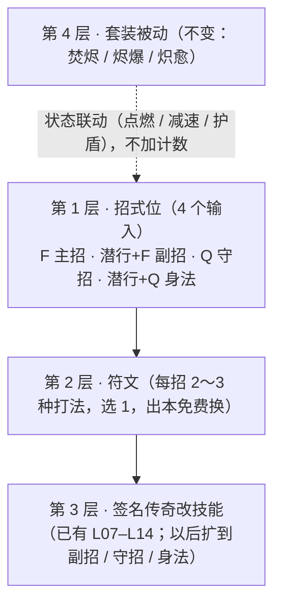

# RESEARCH · 余烬主动技能架构（从新手到毕业「只有一个烬斩太素了」）— 调研稿 + 分阶段方案（D209）

> **状态：调研 + 提案，只是离线文档。** 没有改 CoreRpg 代码、配置、物品或菜单，没有部署、重启，也没有跑机器人。
> **起因：** 服主 2026-10-05 23:21：新手到毕业只有一个主动「烬斩」，太素了，问是不是真的设计过。
> **按服主规矩：** 先看成熟游戏怎么做（D2/D3/D4、PoE、命运方舟、传奇、Wynncraft、MMOCore 服、哈迪斯），再提方案；分阶段，每阶段先离线模拟（`tools/p1sim`）"在范围内"再写代码；不加永久乘区，旧宝石系统保持关闭。
> **与现有计划的关系：** D169 装备分阶段计划（第 3 阶段"刃型决定 F 键主动形状"）和 D174 签名传奇（L07 直线 / L09 环形 / L13 蓄力 / L11、L14 护盾）已经在"改烬斩形状"。本稿是**技能这一层的总架构**，会建议修改 D169 第 3 阶段（§5.4）。D169 的代码 HOLD 不受本稿影响：本稿的 S0 只做离线模拟。

---

## 0. 给服主的话（一页看懂）

**直说：** 是设计过的，但设计目标是"把数值管住"，不是"让战斗好玩"。P1 书 §4.2 为了控数，把旧的三招（烬斩 / 灰印 / 守墓壁垒）+ 可装配踏步砍成"三套共用一个烬斩 + 一个无伤害踏步"，并写死"以后新增主动只能**替代**烬斩，不能变成第二个主动"。结果就是：

- 新手第 1 分钟拿到的按键，和毕业玩家**完全一样**：F 烬斩（8 秒一次）、潜行 + Q 踏步（14 秒一次）。
- 后面所有成长都是**看不见的数字**：套装每 N 下自动触发、天赋每条只有 ±1%～3%、词条 1 条。签名传奇里有 3 把刃会把烬斩改成直线 / 环形 / 蓄力，这是唯一能"手上感觉到"的变化，但只在 Q04 以后、而且要刷到那把刃。
- 战斗里玩家唯一的决定是"8 秒到了按 F"。

**成熟游戏的共同做法（§2）：** 技能会**越打越多**（D4 动作栏 6 格、Wynncraft 4 个法术、传奇战士从 7 级到 35 级陆续学到 6 招），每招一个**清楚的分工**（单体爆发 / 群伤 / 位移 / 控制 / 保命）；拿到新招是**里程碑**；后期继续给"同一招的不同打法"（暗黑 3 的符文、命运方舟的三脚架），这些选择**基本是换打法、不是加伤害**，可以随时免费换。

**我的方案（§4）：** 不加职业，不加永久乘区，做 4 件事：

1. **4 个招式位，跟主线一张一张开：** F 主招（烬斩，Q01）· 潜行 + F 副招（Q02 首通开）· Q 守招（Q03 首通开）· 潜行 + Q 身法（踏步，Q01 就有，Q05 起有变体）。1.12 原版客户端就能按，不用 mod。
2. **每招 2～3 种"符文"（打法）：** 比如烬斩 = 扇形（现在）/ 直线穿刺 / 原地环斩；副招从 烬突（冲刺穿过）/ 灰印（标记 + 减速）里选；守招从 守墓壁垒（短减伤）/ 破势（打断首领蓄力）里选。符文随主线首通解锁，出了副本随时免费换。
3. **伤害总量不变：** 所有主动加起来，占单体输出的比例维持在今天烬斩的水平（约 10%），新招主要给**控制、位移、保命、清杂兵手感**，不是给首领伤害。S0 先在模拟器里证明这一点再写代码。
4. **签名传奇继续改技能（像 D4 威能）：** 已有的 L07/L09/L13 等保留；以后新签名可以改副招 / 守招 / 身法，而不只是烬斩。

**分 5 个阶段（§6），每阶段单独版本、单独模拟、单独冒烟。** 第一阶段只是离线模拟和这份文档，不碰代码。

---

## 1. 现状诊断（读代码与配置，2026-10-06）

| 层 | 现在有什么 | 玩家手上能感觉到吗 | 证据 |
|---|---|---|---|
| 主动 | 烬斩：F 键（主手是有效 P1 刃时），1.5B，8 秒，正前 100°、3.5 格、最多 5 个；不暴击、不吸血、不触发套装计数 | 能，但从 Q01 到毕业**不变** | `SkillService.onSwapHotkeyP1` / `castEmberSlashP1`；P1 书 §4.2、§7 |
| 身法 | 踏步：潜行 + Q，向前 5 格，14 秒，无伤害、无无敌 | 能，**不变** | `FlexSkillService`（`flex.hotkey: sneak_drop`）；`EmberRunService` 装配提示 |
| 套装 | 焚烬每 3 下点燃 / 烬爆每 5 下爆炸 / 炽愈 +12% 生命、每 5 下回血 | 被动自动触发，不用操作 | P1 书 §4.2 |
| 天赋 | 3 排（应变 / 猎手 / 套装专精），每条 ±1%～3%（第 2 排对词缀精英 ±15%～60%） | 几乎感觉不到 | `ember-v1-growth.yml talents` |
| 签名传奇 | Q04 L07 烬斩直线穿刺 / Q05 L09 环形 / Q07 L13 0.5 秒蓄力环；L08 烬斩点燃；L11 / L14 烬斩护盾 | 能，但只改烬斩、要先刷到 | `DESIGN-ember-mainline-unlocks-2026-10-04.md` §3 L07–L14 |
| 挂机庭 | 自动普攻 + 冷却好自动烬斩 | — | `ember-v1.yml` afk 段 |

**算一下烬斩在输出里的份量（P1 书 §7 口径）：** 普攻 1.6 次 / 秒、10% 暴击 ×1.5 → 平均每下 1.05B；8 秒普攻 12.8 下 ≈ 13.44B，烬斩 1.5B → **烬斩约占单体输出 10%**。所以烬斩本身不是"输出核心"，它是"每 8 秒一次的小爆发"。这也说明：**加招的空间在玩法上，不在伤害上。**

**2026-10-04 的模拟已经告诉我们的两条硬约束**（`DESIGN-ember-growth-sidegrades-2026-10-04.md` §6）：
- 烬斩 1.5B 正好卡在杂兵"一刀线"上，降到 1.05～1.35B 杂兵房就慢 8%～19%，**烬斩系数不能降**。
- 技能点燃如果比套装点燃弱，会把首领身上的燃烧快照"毒化"（重复点燃只延长不换快照），首领用时 +9%～18%。**任何技能带点燃必须用套装同系数。**

**之前（`RESEARCH-ember-gear-reference-2026-10-04.md` §6）下过一个结论"最多 2 个主动输入，第三个不要做"**——理由是数字键会切走主手的刃、左右键三连会和普攻计数冲突。这条结论漏了两个不冲突的输入：**潜行 + F** 和 **单按 Q（手持 P1 刃时）**。§3.2 重新评估。

---

## 2. 参考游戏怎么做

### 2.1 一览

| 游戏 | 主动数量（毕业） | 怎么解锁 | 同一招的不同打法 | 选择是"换打法"还是"加数" | 来源 |
|---|---|---|---|---|---|
| 热血传奇（战士） | 约 6 招常用：基本剑术（被动）、攻杀、刺杀、半月、野蛮冲撞、烈火 | 按等级学技能书：攻杀 19、刺杀 25、半月 28、野蛮 30、烈火 35；书从尸王殿 / 祖玛教主等首领和商店来；每招再靠"熟练度"升 3 级 | 无（每招固定） | 每招**分工不同**：刺杀 = 隔位穿刺破防、半月 = 扇形群伤、野蛮 = 推人控制、烈火 = 隔一段时间一次的单体爆发 | [S1][S2] |
| 暗黑 3 | 动作栏 6 招（选自每职业约 20 招） | 30 级前每升 1 级几乎都给新招；符文 6 级起陆续到 60 级 | 每招 5 个符文，选 1 | 符文主要**改机制**（单体变群体、换元素、加控制），随时免费换 | [S3][S4][S5] |
| 暗黑 4 | 动作栏 6 格 | 2 级开 1 格、4 级 2 格、8 级 6 格全开；技能点来自升级和声望 | 技能树里每招有强化 + 二选一升级；传奇威能改技能行为 | 升级二选一多是**换打法**；威能可以很强（数值也在里面） | [S6][S7][S13] |
| 命运方舟 | 8 招 | 技能点投到某一招：4 级开第 1 层三脚架、7 级第 2 层、10 级第 3 层 | 第 1、2 层各 3 选 1，第 3 层 2 选 1 | 有加伤也有改形状；装备可以提高三脚架等级；随时免费改 | [S8][S9] |
| 流放之路 | 不限（受孔位限制） | 技能宝石插装备孔，辅助宝石连孔改技能 | 辅助宝石 | 很多是**乘区**（Ember 不学这部分） | [S10] |
| Wynncraft（原版客户端 MC 服） | 4 个法术 + 技能树 | 战斗等级给能力点，点技能树节点解锁法术和改法术的节点 | 技能树 3 条原型路线，很多节点**替换**原法术 | 换打法为主 | [S11][S12] |
| MMOCore 服（Spigot 插件） | 最多 6 个绑定 | 等级 / 任务 / 技能树解锁，菜单绑定到技能位 | 按服配置 | 按服配置 | [S14] |
| 哈迪斯 | 固定 5 个输入（攻击 / 特殊 / 施法 / 冲刺 / 召唤） | 输入一开始就有 | 每个输入**只能挂 1 个**核心祝福，新的替换旧的 | **按位替换**，天然是侧移 | [S15] |

### 2.2 从这些游戏里抽出来的规律

- **R1 · 招会越来越多，但有上限。** 毕业 4～8 招，没有人只给 1 招。新招在前中期一张一张给（暗黑 3 到 30 级给齐、传奇 35 级给齐、D4 8 级就开满 6 格），后期不再加新按键。
- **R2 · 每招一个分工。** 传奇战士最典型：一个破防、一个群伤、一个控制推人、一个爆发；玩家的操作就是"什么时候用哪个"（传奇老玩家的刷怪连招：野蛮冲撞聚怪 → 半月清 → 刺杀补刀 [S2]）。
- **R3 · 拿到新招是里程碑，而且和"去哪刷"绑在一起。** 传奇的技能书从特定首领掉；D3 / D4 跟等级。Ember 没有等级驱动的主线，**主线首通**就是最自然的里程碑（服主定的"每张图解锁新玩法"）。
- **R4 · 后期给"同一招的不同打法"，不再给新按键。** D3 符文、方舟三脚架、D4 升级二选一、Wynncraft 技能树替换节点，都是这一层。**一层只能选一个**（方舟每层 1 个、D3 每招 1 个符文、哈迪斯每位 1 个祝福），所以"多拿"不等于"多叠"。
- **R5 · 打法放在角色身上、免费换，比放在掉落物上好管。** 暗黑 3 开发时原本让符文作为掉落物品、每种 7 个品质，后来改成随等级解锁；当时的说法是 120 个技能 × 5 符文 × 品质会变成约 3000 种符文物品，"知道会出问题" [S5]。方舟也是三脚架本身随技能点解锁，装备只**提高**等级 [S9]。
- **R6 · 装备再在上面改技能。** D4 威能、PoE 宝石、方舟三脚架等级、Ember 现有签名传奇——这一层负责"刷到好东西手上变了"。

### 2.3 哪些不学

- PoE 式辅助宝石连乘、D4 式"威能 +数百%"：违反 Ember"无永久乘区"。
- 传奇式"熟练度把同一招从 1 级升到 3 级、伤害越升越高"：这是永久数值成长，违反预算；只学它的"按里程碑学新招"和"每招分工"。
- 冷却缩减、多层充能：P1 书 §7.2 禁止冷却缩减；本稿不引入。
- 职业：P1 书已定无职业；三族套装就是"路线"。

---

## 3. Ember 的约束

### 3.1 数值约束（全部来自 P1 书和已有模拟）

| # | 约束 | 来源 |
|---|---|---|
| C1 | 不加永久伤害 / 生命乘区；成长只能侧移 | 业主 2026-10-04 15:19；本 routine 硬限 |
| C2 | 技能不暴击、不吸血、默认不触发套装计数（改这条要重新模拟） | P1 书 §4.2、§7；C06 |
| C3 | 烬斩 1.5B 不降（杂兵一刀线） | growth-sidegrades §6 |
| C4 | 技能点燃必须用套装同系数（快照毒化） | growth-sidegrades §6 |
| C5 | 不开冷却缩减 / 攻速 / 暴伤词条 | P1 书 §7.2 |
| C6 | 签名传奇：最多 2 条生效，同标签不叠，有功率预算（`mainline.py SIGS`） | D174；ARCH G2 |
| C7 | 位移要过碰撞和门控检查，不能跳过未完成房间 | P1 书 M06、§9 |

**主动伤害预算（本稿新定义，S0 验证）：** 所有主动技（主招 + 副招 + 守招 + 身法）在模拟器"长窗单体"口径下合计 ≤ 今天烬斩的份额（约 10%）+ 容差；首领用时、杂兵房用时都要落在 p1sim 现有容差内（和签名传奇同一套检查）。也就是说：**副招 / 守招对首领基本不带伤害，或者带伤害就要有代价（施放时间、对首领 ×系数），** 它们的价值在控制、清杂兵手感、保命和躲招。

### 3.2 按键（1.12 原版客户端，无 mod）

| 输入 | 现在 | 能不能用 | 风险 |
|---|---|---|---|
| F | 烬斩 | 已用 | — |
| 潜行 + Q | 踏步 | 已用 | — |
| **潜行 + F** | 无（P1 里也是放烬斩） | **能**：`PlayerSwapHandItemsEvent` 里看 `isSneaking()` 分流 | 潜行时移动变慢——副招设计成"站桩也能用"的招 |
| **单按 Q（主手是有效 P1 刃）** | 把刃扔到地上 | **能**：取消 `PlayerDropItemEvent` 改成放招 | 1. 玩家不能再用 Q 扔刃（背包里拖出去仍可）；2. 取消丢弃后客户端偶尔要补发一次物品栏刷新，S1 冒烟专门测一次 |
| 数字键 | 切物品栏 | **不用** | 会切走主手的刃（套装要求刃在主手） |
| 左右键三连（Wynncraft） | 普攻 | **不用** | 和普攻计数冲突，套装每 N 下触发会乱 |
| F 进施法模式 + 数字键（MMOCore） | — | **不用** | F 已经是烬斩；而且按到当前选中格的数字键不会触发事件，要整体偏移 [S14]，新手难懂 |

**结论：** 改为 **4 个输入**（F / 潜行 + F / Q / 潜行 + Q），推翻 2026-10-04 "最多 2 个"的结论；理由是那次只考虑了数字键和三连，没考虑潜行组合和单按 Q。

### 3.3 其它系统的连带

- **挂机庭（自动战斗）：** 现在冷却好自动放烬斩。新增招在挂机里只自动放"主招 + 副招"，守招 / 身法不自动放（保住挂机 < 副本，D177）。
- **签名传奇：** L07/L09/L13 现在是"替换烬斩形状"。如果烬斩有了符文，就要定"签名和符文谁说了算"（§5.4）。
- **天赋第 1 排（应变）** 是围绕"躲首领预警招"做的；守招 / 身法变体也在这个领域，S2 要一起复核，避免同一件事两套加成（同标签不叠，C6 的做法）。
- **D169 装备第 3 阶段"刃型决定 F 键形状"**：和 R5 冲突（把打法放在掉落随机上），建议改（§5.4）。

---

## 4. 提案：四层技能架构

### 4.1 第 1 层 · 招式位与主线解锁

| 位 | 按键 | 分工 | 解锁 | 冷却（起点，S0 定） | 默认招 |
|---|---|---|---|---|---|
| 主招 | F | 小爆发 + 清杂兵 | 一开始 | 8 秒（不变） | 烬斩（扇形，现行数值不变） |
| 副招 | 潜行 + F | 控制 / 聚怪 / 标记 | **Q02 首通** | 10～12 秒 | 灰印（见下） |
| 守招 | Q | 保命 / 打断首领 | **Q03 首通** | 15～20 秒 | 守墓壁垒（见下） |
| 身法 | 潜行 + Q | 躲招 / 走位 | 一开始（现行踏步） | 14 秒（不变） | 踏步 |

Q04 起每张图首通解锁"符文"（§4.2），Q07 首通解锁"终式"候选（§4.3，S4 再定）。这样 Q01→Q03 每张图都给一个**新按键**，Q04→Q07 每张图给**新打法**，正对应 R1 / R3 / R4。和已有的天赋点首通奖励（Q03 / Q05 / Q07）同时发，不冲突。

**候选招（全部来自旧版已有的招或签名已有的形状，不新编机制；数值是 S0 的起点，不是定稿）：**

| 位 | 候选 | 做什么 | 预算口径 |
|---|---|---|---|
| 副招 | **灰印**（改编旧誓约技，去掉旧版的追加伤害） | 标记前方 8 格内最近的敌人 4 秒：缓慢 I；标记中的敌人被你打倒时，周围 3 格的敌人缓慢 1 秒 | 无伤害、无易伤（不做"标记后伤害 +X%"，那是乘区） |
| 副招 | **烬突** | 向前冲 4 格，穿过的敌人各受 0.5B，过碰撞 / 门控检查 | 对首领 ×0.5（只算 1 次）；冲刺距离计入身法规则 |
| 副招 | **聚火** | 原地 4 格内的杂兵往你身边拉 1.5 格（首领 / 精英不拉） | 无伤害；对标传奇"野蛮冲撞聚怪"的作用 |
| 守招 | **守墓壁垒**（旧誓约技复用） | 2 秒内受到的伤害 −40%，期间不能普攻 | 用"停手 2 秒"付代价 |
| 守招 | **破势** | 首领蓄力 / 预警时按下：在 1 秒判定窗内打断（判定窗参考现有破招 D193 的蓄力阶段；首领每轮只能被打断 1 次） | 无伤害；首领战节奏要进 p1sim |
| 身法 | 踏步（现行） / **后撤步**（向后 4 格） / **火痕步**（踏步留 2 秒火痕，点燃用套装同系数，C4） | 变体 Q05 首通解锁 | 火痕步的点燃算进伤害预算 |

### 4.2 第 2 层 · 符文

- 每招 2～3 种符文，**选 1 个**；出副本（主城 / 挂机庭以外的安全区）**免费**换；换了以后该招冷却直接转满（防"换符文刷冷却"，D3 早期换技能 / 符文在野外会触发 10 秒冷却 [S3]）。
- **烬斩符文 = 把签名传奇已经验证过的形状拿出来**：扇形（默认）/ 直线穿刺（同 L07：最多 3 个）/ 原地环斩（同 L09：3 格内最多 3 个）。数值沿用 D174 已经过预算的版本，不另起炉灶。
- 解锁顺序（初稿）：Q04 首通 → 烬斩第 2、3 种形状；Q05 → 身法变体；Q06 → 副招第 3 种；Q07 → 守招第 2 种 + 终式候选。挑战版 / 团本 / 深渊**不**解锁新符文（避免把基础打法锁在高难里），只给签名传奇（第 3 层）。

### 4.3 终式（S4 再定，先列出来）

参考方舟"觉醒技"和 Wynncraft 终极法术：Q07 首通后，套装触发攒"余烬"（满 100），满了按 潜行 + F 两次放一次大招。**风险：** 这是最容易变成乘区的一招，所以 S4 只在 S0～S3 都过、真人数据回来之后才考虑；现在**不做**。

### 4.4 第 3 层 · 签名传奇（已有，扩展方向）

- 现有 L07 / L09 / L13 改烬斩形状：**保留**，但定规则"签名形状覆盖符文形状"（戴着 L07 时烬斩就是直线，符文页显示"被 潮闸长杆 覆盖"）。
- 以后新签名可以改副招 / 守招 / 身法（例：守招触发时给 0.5% 护盾 = L11 的口径），同样受 C6（最多 2 条、同标签不叠、功率预算）。

### 4.5 第 4 层 · 套装联动（不改计数）

技能不触发套装计数（C2）。联动只走**状态**：焚烬的人用火痕步 = 多一个点燃来源（同系数）；烬爆的人用聚火 = 爆炸更容易打满 5 个；炽愈的人用守墓壁垒 = 回血窗口更安全。这样三族各自有"顺手的组合"，但没有新乘区。

---

## 5. 设计与漏洞审查（发布前每阶段都要过）

| # | 风险 | 处理 |
|---|---|---|
| X1 | 换符文 / 换招刷冷却 | 换了就冷却转满；只能在安全区换 |
| X2 | 守招 2 秒 −40% 卡首领大招 | p1sim 里按"大招必挡"最坏情况算首领战；必要时守招冷却 ≥ 首领大招间隔 |
| X3 | 破势打断无限控首领 | 首领每轮只能被打断 1 次，和 D193 破招共用计数 |
| X4 | 烬突 / 后撤步 / 火痕步穿墙、跳房间 | 全部走踏步同一套碰撞 + 门控检查（C7） |
| X5 | 聚火把怪拉出房间 / 卡房间事件 | 只拉同一房间、非首领非精英；占点 / 护灯事件里的目标怪不拉 |
| X6 | 灰印做成易伤 | 明确不做"标记后伤害 +X%"；只有缓慢 |
| X7 | 挂机庭自动放招变强 | 挂机只放主招 + 副招；挂机收益仍按击杀计、每日上限不变 |
| X8 | 单按 Q 取消丢弃造成物品不同步 / 复制 | 取消事件不生成掉落物；S1 跑一次断线 + 背包刷新检查；资产路径不变则不需要全套 persist-roundtrip，但 S1 仍跑一次 |
| X9 | 多人团本叠控制 | 缓慢不叠等级；同一怪的拉拽 2 秒内只生效 1 次 |
| X10 | 与天赋第 1 排同一件事两套加成 | 守招 / 身法变体打"躲招"标签，和天赋第 1 排同标签不叠（沿用 C6 机制） |

---

## 6. 分阶段计划

| 阶段 | 内容 | 碰代码吗 | 验收 |
|---|---|---|---|
| **S0** | p1sim 加"副招 / 守招 / 身法变体 / 烬斩符文"的模型（复用 `skill_variant` 键和 D174 的形状数据），跑 Q01–Q07、挑战、团本、深渊；定下 §4.1 候选的冷却和系数 | 否（只动 `tools/p1sim`） | 首领用时、杂兵房用时、受伤都在现有容差内；主动合计份额 ≈ 10% + 容差；出 `docs/design/DESIGN-ember-skill-kit-2026-10-xx.md` 定稿 |
| **S1** | 输入分流框架：潜行 + F、单按 Q；技能页菜单（显示 4 个位、哪个已解锁、去哪解锁）；先只上**守招·守墓壁垒**（Q03 首通解锁）——无伤害，最容易控 | 是 | 单测 + 冒烟（新号 Q01→Q03 首通拿到守招，按 Q 生效、Q 不再扔刃）+ X8 检查 |
| **S2** | 副招位（Q02 首通）：灰印 / 聚火 / 烬突；挂机庭自动放副招 | 是 | 冒烟 + p1sim 回归 |
| **S3** | 符文层：烬斩三形状（复用 L07 / L09 数据）、身法变体、破势；签名覆盖规则 | 是 | 冒烟 + p1sim 回归；每个符文单独过容差 |
| **S4** | 终式（看真人数据再决定做不做） | 待定 | — |

> **2026-10-06 S0 已跑（D210，`DESIGN-ember-skill-kit-2026-10-06.md`）：** 各自独立冷却的版本过不了数值关；改为副招花烬斩充能。S1 改成 输入分流 + 技能页 + 副招·烬突 + 烬斩三形状；守招暂缓（S0b），灰印 / 聚火删除。以下表格保留原稿，以 D210 为准。

每阶段单独 `balance_version`、单独 D 号、单独冒烟；S1 起每阶段发版说明里写"新按键"。D169 第 3 阶段"刃型决定 F 键形状"**建议改为**：刃型不再决定技能形状（形状由符文决定，R5），刃型以后若要做只做外观或基础攻击手感；这条在 D169 文档里补注，不另开代码。

---

## 7. 我自己定下的取舍（不问服主）

- 不加职业、不加技能等级、不加冷却缩减（C1 / C5）。
- 先做无伤害的守招（S1），再做带少量伤害的副招（S2），最后做符文（S3）——风险从低到高。
- 符文放在角色身上、随首通解锁、免费换（R5），不做成掉落物。
- 终式先不做（§4.3）。

---

## 参考来源

- [S1] 传奇战士技能学习等级与作用（攻杀 19 / 刺杀 25 / 半月 28 / 野蛮 30 / 烈火 35；技能书来源）：http://www.wuduy.com/html/jishuwenzhang/chuanqi/225766.html ；技能等级表：https://www.21cq.com/mir/Magic.aspx
- [S2] 传奇战士刷怪连招（野蛮聚怪 → 半月 → 刺杀补刀）：http://games.wuduz.com/html/rexuechuanqi/jishujiaocheng/242919.html
- [S3] 暗黑 3 技能符文（每招 5 个，6～60 级陆续解锁，可随时更换）：https://www.diablowiki.net/Skill_Runes ；https://diablo.fandom.com/wiki/Skill_Runes
- [S4] 暗黑 3 官方技能 / 符文解锁表（以武僧为例）：https://us.diablo3.blizzard.com/en-us/class/monk/progression
- [S5] 暗黑 3 把符文从掉落物改为随等级解锁的原因（约 3000 种符文物品的问题）：https://www.cinemablend.com/games/Diablo-3-Skill-Rune-Changes-Revealed-39665.html
- [S6] 暗黑 4 技能栏格子解锁（2 / 4 / 8 级）：https://dotesports.com/diablo/news/how-to-unlock-more-skill-slots-in-diablo-4
- [S7] 暗黑 4 技能树说明：https://www.pcgamesn.com/diablo-4/skill-tree
- [S8] 命运方舟三脚架（技能 4 / 7 / 10 级开 3 层，3 / 3 / 2 选 1，可随时免费改）：https://www.thegamer.com/lost-ark-tripod-skill-upgrades-explained/ ；https://lostark.wiki.fextralife.com/Tripods
- [S9] 命运方舟三脚架等级由装备（护符）提高：https://lostark.fandom.com/wiki/Tripod
- [S10] 流放之路辅助宝石：https://www.poewiki.net/index.php?title=Support_gems
- [S11] Wynncraft 技能树（能力点、原型路线、节点替换法术）：https://wynncraft.wiki.gg/wiki/Ability_Tree ；https://wynncraft.wiki.gg/wiki/Version_2.0
- [S12] Wynncraft 法术三连（原版客户端）：https://wynncraft.wiki.gg/wiki/Warrior/Ability_Tree ；https://wynncraft.wiki.gg/wiki/Archer
- [S13] 暗黑 4 威能：https://www.wowhead.com/diablo-4/guide/gameplay/codex-of-power-legendary-aspects
- [S14] MMOCore 施法模式（F 进入、数字键 1～6 放招、选中格偏移）：https://docs.phoenixdevt.fr/mmocore/skills/casting.html ；技能解锁与绑定：https://docs.phoenixdevt.fr/mmocore/skills/intro.html
- [S15] 哈迪斯祝福按位替换（攻击 / 特殊 / 施法 / 冲刺 / 召唤各一个核心祝福）：https://hades.fandom.com/wiki/Boons
